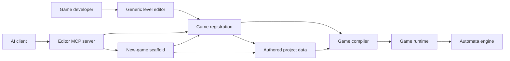
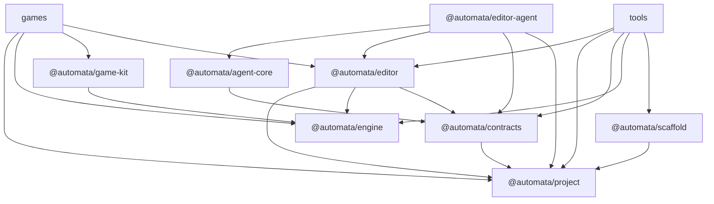
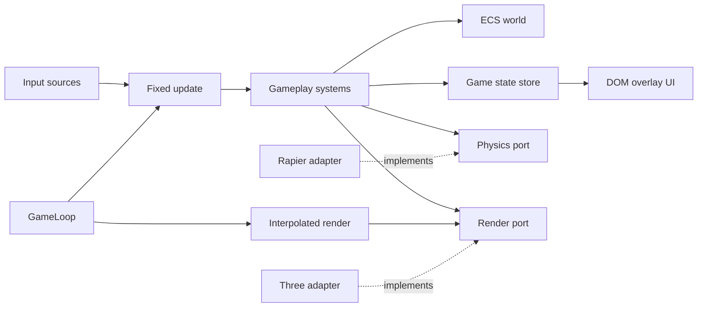
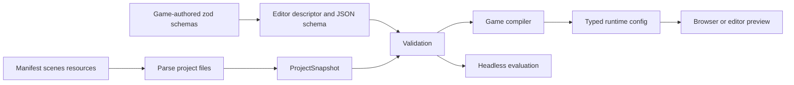
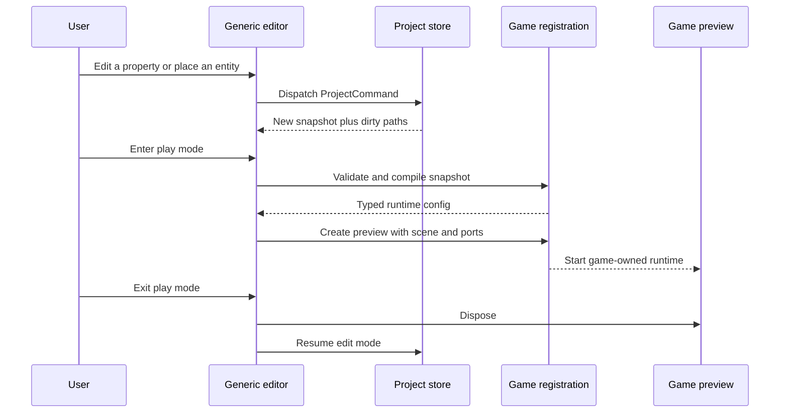
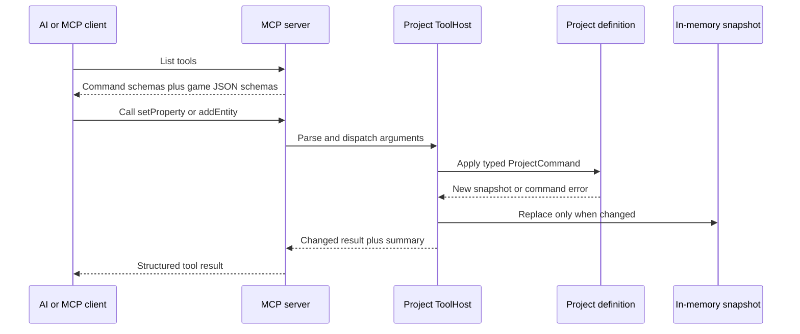

# AutomataEngine Architecture

This guide is for game developers coming from Godot, Unity, or Unreal Engine 5.
It explains AutomataEngine from familiar concepts outward: authored projects,
runtime gameplay, the generic editor, and AI/MCP tooling.

> **Current versus planned:** Unless a section is labeled **Roadmap**, it
> describes code implemented on `main` as of July 2026.

## 1. Start with the mental model

Godot, Unity, and Unreal present runtime code, serialized content, and editor
tools through one large application. AutomataEngine separates them into three
layers:

1. **Runtime** — deterministic gameplay state and systems.
2. **Project model** — persisted scenes, entities, components, and resources.
3. **Tools** — the browser editor, MCP server, scaffold, and optional AI UI.

The separation is intentional. A game can run without the editor, the MCP
server can inspect a project without starting a browser, and the same authored
project can drive browser play, editor preview, and headless evaluation.

The following mappings are approximations, not claims that the engines work
identically:

| Familiar idea | AutomataEngine | Important difference |
|---|---|---|
| Godot project / Unity project / UE project | `ProjectSnapshot` plus a game registration | Persisted data is independent of editor UI and runtime objects. |
| Godot scene / Unity scene / UE level | `SceneDocument` | It is JSON authoring data compiled by the game. |
| Node / GameObject / Actor | `EntityDocument` when authored; an ECS entity at runtime | Authoring identity and runtime representation are separate. |
| Component | `ComponentInstance` | Its schema comes from the game registration; behavior usually lives in systems. |
| Resource / ScriptableObject / Data Asset | `ResourceDocument` | Resources are typed project data, not runtime singletons. |
| PackedScene / Prefab / Blueprint placement | `PrefabRegistration` | A prefab is an editor placement recipe, not a saved nested asset graph. |
| SceneTree / World / UWorld | `World` | The runtime uses ECS queries rather than object-tree traversal. |
| `_physics_process` / `FixedUpdate` / subsystem tick | scheduled `System` functions | Fixed simulation and render interpolation are explicitly separated. |
| Play button / PIE | registration `preview.create(...)` | Each game owns compilation and preview wiring; the editor stays generic. |
| Automation test / commandlet | evaluation adapter | Evaluations run deterministically without browser rendering. |

The most important distinction is this:

> A `SceneDocument` is content that describes a game scene. It is not the live
> runtime world. The game compiles project documents into its own typed runtime
> configuration, then builds the runtime world from that result.

## 2. Whole-system map



### What this means

The reusable engine does not know what a Monkey Ball level or a Pulsebreak wave
is. Each game supplies a **registration** that connects generic infrastructure
to game-specific behavior:

- component and resource schemas;
- a default project template;
- validation and compilation;
- editor prefabs and browser preview; and
- deterministic headless evaluation.

The browser editor and MCP server both consume that contract. The scaffold
generates a working implementation of the same contract for a new game.

### Familiar analogy

Think of the registration as part plugin descriptor, part Unity custom importer,
and part UE game module. Unlike an editor plugin, however, it also defines the
canonical compilation boundary from saved content to runtime configuration.

### Code entry points

- Project definition: [`packages/project/src/registration.ts`](../packages/project/src/registration.ts)
- Editor registration: [`packages/editor/src/project/registration.ts`](../packages/editor/src/project/registration.ts)
- Monkey Ball adapter: [`games/monkey-ball/src/project/editor.ts`](../games/monkey-ball/src/project/editor.ts)
- Pulsebreak adapter: [`games/pulsebreak/src/project/editor.ts`](../games/pulsebreak/src/project/editor.ts)
- Scaffold templates: [`tools/scaffold/src/templates`](../tools/scaffold/src/templates)

### Boundary warning

Games plug into tools. Tools do not gain `if (gameId === ...)` branches. A
game-specific exception belongs in that game's registration or compiler.

## 3. Package boundaries

Arrows in this diagram mean **may depend on**. They do not represent runtime
event flow.



### What this means

The lower layers know less:

- `@automata/project` is the persisted-model leaf. It owns the portable project
  format and schema authoring language but knows nothing about rendering,
  editors, games, or agents.
- `@automata/engine` owns runtime facilities and wraps third-party runtime
  libraries.
- `@automata/editor` combines project and engine APIs into a generic authoring
  environment. It cannot depend on a game.
- `@automata/contracts` defines the typed command, evaluation, prompt, and MCP
  surfaces used across process boundaries.
- `@automata/agent-core` is editor-independent. The optional
  `@automata/editor-agent` package connects it to an editor session.
- A game package includes both game runtime code and game-owned editor adapters,
  which is why the aggregate `games` node may depend on `@automata/editor`.

### Familiar analogy

This resembles separating an engine runtime module, an asset serialization
module, editor modules, and game modules in Unreal—or assembly definitions in
Unity. The difference is that these boundaries are small npm workspaces and are
enforced by imports rather than by one proprietary build system.

### Code entry points

- Executable dependency policy: [`eslint.config.js`](../eslint.config.js)
- Workspace graph: [`package.json`](../package.json)
- Headless editor exports: [`packages/editor/src/headless.ts`](../packages/editor/src/headless.ts)
- Browser-only engine exports: [`packages/engine/src/browser.ts`](../packages/engine/src/browser.ts)
- Data-only engine exports: [`packages/engine/src/data.ts`](../packages/engine/src/data.ts)

### Boundary warning

Do not bypass a boundary merely because npm can resolve the dependency. For
example, a game importing `three` directly makes rendering policy game-owned
and defeats the engine port. The lint rules reject this class of shortcut.

## 4. Runtime architecture



### What this means

The runtime uses a fixed simulation step and a separately rendered frame:

1. `GameLoop` accumulates elapsed time.
2. It runs zero or more fixed updates, normally at 60 Hz.
3. Gameplay systems read and update entities in the ECS `World`.
4. Systems use narrow ports for physics, rendering, audio, and other services.
5. Rendering receives an interpolation factor so visual movement can remain
   smooth between fixed updates.

An **ECS** stores data components on entities and lets systems query for the
combinations they need. A **port** is an interface the game can call. An
**adapter** implements that interface with a concrete library. Rapier and Three
are adapters; gameplay code is written against `PhysicsPort` and `RenderPort`.

The ECS world and the game state store serve different purposes. The world is
good for per-entity simulation state. The Redux-style store is good for
application state such as menus, progression, settings, and run status.

### Familiar analogy

- Fixed update corresponds roughly to Godot `_physics_process`, Unity
  `FixedUpdate`, or a fixed-rate UE subsystem.
- Systems resemble Unity ECS systems or UE processors more than MonoBehaviours,
  Nodes, or Actors.
- Ports resemble engine-facing interfaces that can be backed by production,
  null, recording, or test implementations.

### Code entry points

- Loop: [`packages/engine/src/loop/gameLoop.ts`](../packages/engine/src/loop/gameLoop.ts)
- ECS world facade: [`packages/engine/src/ecs/world.ts`](../packages/engine/src/ecs/world.ts)
- Scheduler: [`packages/engine/src/ecs/scheduler.ts`](../packages/engine/src/ecs/scheduler.ts)
- Physics port: [`packages/engine/src/physics/port.ts`](../packages/engine/src/physics/port.ts)
- Render port: [`packages/engine/src/render/port.ts`](../packages/engine/src/render/port.ts)
- Null renderer for tests: [`packages/engine/src/render/null.ts`](../packages/engine/src/render/null.ts)
- Example gameplay composition: [`games/pulsebreak/src/game/gameplay.ts`](../games/pulsebreak/src/game/gameplay.ts)

### Boundary warning

Games consume engine APIs. They do not import Three, Rapier, Miniplex, zod,
YAML, or TOML directly. Browser-only input, audio, and renderer construction
come from `@automata/engine/browser`; headless code must avoid that entry point.

## 5. Authored projects and compilation



### What this means

A project directory has three kinds of JSON documents:

```text
automata.project.json             identity, gameId, entry scene, file index
scenes/<id>.scene.json            entity hierarchy and component instances
resources/<id>.resource.json      typed tuning and content resources
```

Games author component and resource data schemas with zod through
`@automata/project`. Registration derives two things from the same source:

- a closed descriptor used to generate editor controls; and
- JSON Schema advertised to MCP clients.

Loading parses the files into a `ProjectSnapshot`. Validation checks both core
structure and game-owned rules. Compilation then turns the generic snapshot
into the game's typed runtime configuration. Monkey Ball produces level and
tuning data; Pulsebreak produces arena, enemy, wave, upgrade, and tuning data.

Evaluation is a sibling of browser play, not a screenshot test. It runs a
deterministic simulation against the project and returns normalized metrics an
agent or test can compare.

### Familiar analogy

This is closest to importing Unity assets into typed runtime data, or cooking UE
assets for play. Unlike a `.tscn`, Unity scene, or `.umap`, Automata's persisted
model stays deliberately generic; game-specific meaning enters through schemas
and compilation.

### Code entry points

- Project model: [`packages/project/src/model.ts`](../packages/project/src/model.ts)
- Zod authoring helpers: [`packages/project/src/authoring.ts`](../packages/project/src/authoring.ts)
- Editor/JSON-schema derivation: [`packages/project/src/derive.ts`](../packages/project/src/derive.ts)
- Folder loader: [`packages/project/src/files.ts`](../packages/project/src/files.ts)
- Generic validation: [`packages/project/src/validation.ts`](../packages/project/src/validation.ts)
- Monkey Ball definition and compiler: [`definition.ts`](../games/monkey-ball/src/project/definition.ts), [`compiler.ts`](../games/monkey-ball/src/project/compiler.ts)
- Pulsebreak definition and compiler: [`definition.ts`](../games/pulsebreak/src/project/definition.ts), [`compiler.ts`](../games/pulsebreak/src/project/compiler.ts)

### Boundary warning

Do not serialize the live ECS world as the project format. Runtime state contains
transient library objects and simulation details; project documents are stable,
portable authoring data.

## 6. Generic editor architecture



### What this means

The editor is one generic application, not one editor per game. A discovered
registration supplies the facts that differ:

- available component and resource types;
- generated inspector descriptors;
- prefabs and spatial gizmos;
- project validation and compilation; and
- preview/evaluation adapters.

Every edit is a typed `ProjectCommand`. The store applies commands immutably,
tracks selection and active scene, records undo/redo history, and records exact
dirty document paths. Folder-backed storage uses the browser File System Access
API when available. Portable bundle import/export and local autosave provide
fallback and recovery paths.

Browser discovery uses Vite's `import.meta.glob` over each game's
`src/project/editor.ts`. Node discovery uses package exports and the headless
loader. Both routes resolve the same catalog contract and verify that directory,
package, and game IDs agree.

### Familiar analogy

The generated inspector feels like Godot's Inspector, Unity's serialized field
inspector, or UE Details panels. Play mode resembles PIE, but the game owns the
preview adapter while the shared editor owns lifecycle and cleanup.

### Code entry points

- Registration catalog: [`packages/editor/src/project/catalog.ts`](../packages/editor/src/project/catalog.ts)
- Editor store: [`packages/editor/src/project/store.ts`](../packages/editor/src/project/store.ts)
- Editor host: [`packages/editor/src/project/host.ts`](../packages/editor/src/project/host.ts)
- Generated UI exports: [`packages/editor/src/ui/index.ts`](../packages/editor/src/ui/index.ts)
- Storage contract: [`packages/editor/src/project/storage/port.ts`](../packages/editor/src/project/storage/port.ts)
- Folder storage: [`packages/editor/src/project/storage/fileSystem.ts`](../packages/editor/src/project/storage/fileSystem.ts)
- Browser catalog: [`tools/level-editor/src/projectCatalog.ts`](../tools/level-editor/src/projectCatalog.ts)
- Editor application composition: [`tools/level-editor/src/editorApp.ts`](../tools/level-editor/src/editorApp.ts)

### Boundary warning

The editor may ask a registration to compile or preview a game, but shared editor
code must never import Monkey Ball or Pulsebreak. Game-specific UI or behavior
belongs in schemas, descriptors, prefabs, and registration adapters.

## 7. AI and MCP architecture

MCP means **Model Context Protocol**. It gives an AI client typed tools and
resources rather than asking it to edit arbitrary JSON blindly.



### What this means

The MCP server has distinct modes:

- `--workspace <repoRoot>` exposes `createGame` and `listGames`.
- `--project <directory>` loads a registered project's folder.
- `--bundle <file>` loads a portable project bundle.

Project and bundle modes expose read, mutation, validation, and evaluation
tools. Arguments are parsed with schemas from `@automata/contracts`; project
registrations decorate relevant commands with game-specific JSON schemas. The
ToolHost applies the same `ProjectCommand` model used by the editor. Command
application enforces operation-level structure, schemas, and cardinality. The
separate `validate` tool runs whole-project and game-specific validation; the
`evaluate` tool refuses to run while validation errors remain.

An MCP process owns an isolated in-memory snapshot. Mutation tools do not
silently overwrite source project files. Persistence remains an explicit
editor/project workflow.

`@automata/agent-core` is a provider-neutral loop over normalized messages,
tool calls, and results. Anthropic, OpenAI, and DeepSeek adapters live behind
that interface. `@automata/editor-agent` is optional browser UI that attaches
the loop to a `ProjectEditorCore`; the editor itself does not depend on AI.

### Familiar analogy

Treat MCP tools like a typed editor automation API or commandlet surface. The
AI is a client of the same project rules as a human editor—not a privileged
runtime object with permission to mutate anything.

### Code entry points

- Project tool contracts: [`packages/contracts/src/tools.ts`](../packages/contracts/src/tools.ts)
- Workspace tool contracts: [`packages/contracts/src/workspaceTools.ts`](../packages/contracts/src/workspaceTools.ts)
- Project ToolHost: [`packages/editor/src/project/toolHost.ts`](../packages/editor/src/project/toolHost.ts)
- MCP server: [`tools/editor-mcp-server/src/server.ts`](../tools/editor-mcp-server/src/server.ts)
- Workspace host: [`tools/editor-mcp-server/src/workspaceHost.ts`](../tools/editor-mcp-server/src/workspaceHost.ts)
- Provider-neutral contract: [`packages/agent-core/src/providers/provider.ts`](../packages/agent-core/src/providers/provider.ts)
- Optional editor integration: [`packages/editor-agent/src/index.ts`](../packages/editor-agent/src/index.ts)

### Boundary warning

Tool schemas constrain individual operations; they do not replace project
validation, compilation, or evaluation. A syntactically valid command can still
produce a game-invalid project, so agents should validate and evaluate after
meaningful changes.

## 8. Building a game on the paved road

```mermaid
flowchart LR
    Idea[Game description] --> Agent[Developer or AI agent]
    Agent --> Create[createGame or npm run new-game]
    Create --> Skeleton[Playable registered skeleton]
    Skeleton --> Author[Author schemas scenes resources and systems]
    Author --> Evaluate[Headless evaluation]
    Evaluate --> Refine[Refine project and code]
    Refine --> Evaluate
    Refine --> Gates[CI coverage build and E2E]
    Gates --> Browser[Browser game]
```



### What this means

`npm run new-game <name>` and the workspace MCP `createGame` tool call the same
scaffold library. The generated game already includes:

- a deterministic playable simulation;
- a project definition, compiler, template, and shipped project files;
- browser and headless registration loaders;
- editor preview and evaluation;
- focused tests and a browser smoke test; and
- a workspace-local `automata.devPort`.

No root catalog or Playwright file is edited. The browser discovers the editor
loader by convention; Node discovers the `./project` package export; dev and
E2E servers discover `automata.devPort`. After scaffolding, `npm install` links
the new npm workspace so Node can import its package exports. `npm run
verify:new-game` proves the whole path in a clean clone: scaffold, install, CI,
build, MCP load, and browser smoke.

The north star is description-to-finished-game automation. The current paved
road guarantees a sound registered skeleton and typed authoring/evaluation
tools. It does not yet make the creative and gameplay decisions required for a
finished game.

### Familiar analogy

This is more than Unity's project template or UE's new-project wizard because
the output includes editor/MCP registration and headless evaluation. It is less
than a complete genre framework: the generated game is a vertical skeleton to
replace and extend.

### Code entry points

- Scaffold library: [`tools/scaffold/src/index.ts`](../tools/scaffold/src/index.ts)
- Template source: [`tools/scaffold/src/templates`](../tools/scaffold/src/templates)
- New-game verification: [`tools/scaffold/scripts/verify-new-game.ts`](../tools/scaffold/scripts/verify-new-game.ts)
- Browser discovery: [`tools/level-editor/src/projectCatalog.ts`](../tools/level-editor/src/projectCatalog.ts)
- Node discovery: [`tools/editor-mcp-server/src/projectCatalog.ts`](../tools/editor-mcp-server/src/projectCatalog.ts)
- Convention-driven E2E servers: [`playwright.config.ts`](../playwright.config.ts)

### Boundary warning

The scaffold is the paved road, so changing engine, project, or registration
APIs requires updating templates and rerunning `npm run verify:new-game`. A
green existing-game suite alone does not prove a newly generated game works.

## 9. Repository map and roadmap

### Where should I make a change?

| Goal | Start here | Keep in mind |
|---|---|---|
| Change reusable runtime behavior | [`packages/engine`](../packages/engine) | Preserve ports/adapters and headless compatibility. |
| Change persisted authoring data | [`packages/project`](../packages/project) | This is the dependency leaf and portable format owner. |
| Change generic editor behavior | [`packages/editor`](../packages/editor) | Do not introduce game-specific branches. |
| Change browser editor composition | [`tools/level-editor`](../tools/level-editor) | Keep browser APIs out of headless packages. |
| Define game schemas or compilation | `games/<name>/src/project` | The definition is generic authoring truth; the compiler creates runtime truth. |
| Change gameplay | `games/<name>/src/game`, `sim`, or `systems` | Depend on engine ports, not third-party engine libraries. |
| Change MCP command contracts | [`packages/contracts`](../packages/contracts) | Derive transport schemas rather than duplicating them. |
| Change MCP transport or hosting | [`tools/editor-mcp-server`](../tools/editor-mcp-server) | Keep stdout protocol-clean and project writes isolated. |
| Change generated games | [`tools/scaffold`](../tools/scaffold) | Run `npm run verify:new-game`. |
| Change optional embedded AI | [`packages/agent-core`](../packages/agent-core) or [`packages/editor-agent`](../packages/editor-agent) | Keep the generic editor independent of providers. |
| Change shared browser game chrome | [`packages/game-kit`](../packages/game-kit) | The kit may depend on the engine, never games or editor. |

### A practical reading order

For a first contribution, read only the slice relevant to the task:

1. [`README.md`](../README.md) for commands and conventions.
2. The owning package's `src/index.ts` or narrow export such as `headless.ts`.
3. One existing focused test beside the subsystem.
4. One game consumer that proves the abstraction in real use.

Avoid starting with application `main.ts` files. They are thin composition
roots and show construction order, but not the contracts each subsystem owns.

### Roadmap, not current behavior

Architecture work beyond what is on `main` — project-file migrations, richer
`@automata/game-kit`, persistent MCP project sessions, generated agent
documentation, and deeper product acceptance — is tracked authoritatively in
[`docs/ROADMAP.md`](ROADMAP.md), the living, status-tracked roadmap. It maps the
near-term P-series onto the [Autonomous Game Factory design](superpowers/specs/archive/2026-07/week-27/2026-07-04-autonomous-game-factory-design.md),
the strategic destination for the prompt-to-game direction.

Nothing on that roadmap should be assumed available merely because its design or
implementation plan exists; check its status there.

### Keeping this guide accurate

Update this document when any of these contracts change:

- workspace dependencies or public package entry points;
- project document structure or migration behavior;
- game registration and discovery conventions;
- editor storage, preview, or command flow;
- MCP modes, tools, or agent ownership; or
- scaffold output and release gates.

Detailed API reference belongs beside the package that owns it. This document
should remain the map that helps a game developer choose the correct road.
