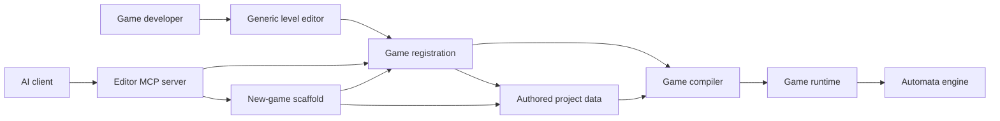
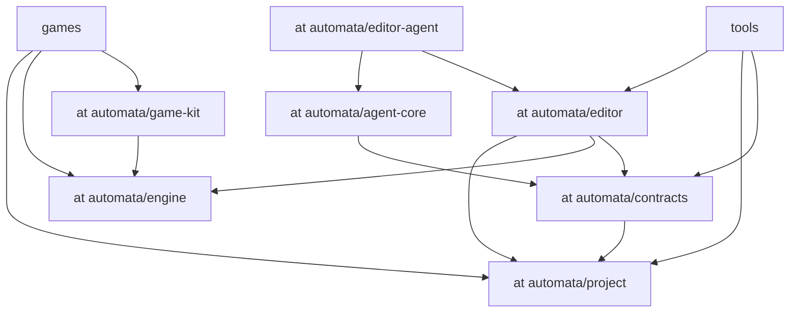
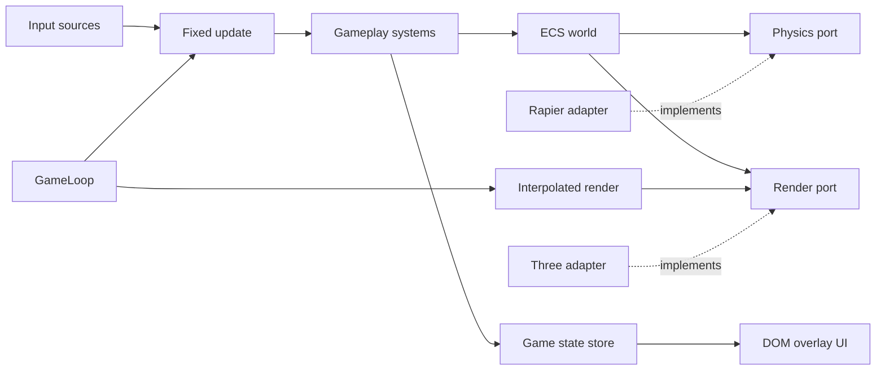
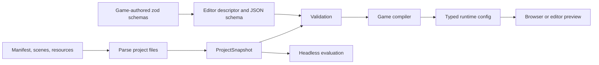
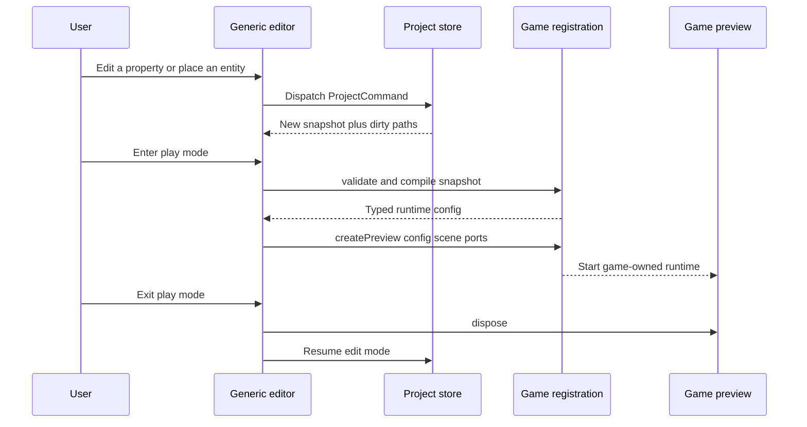
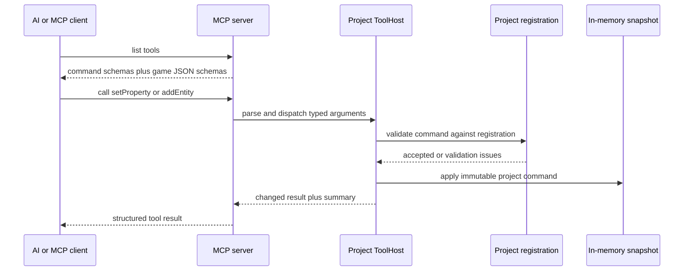

# Engine Architecture Guide Implementation Plan

> **For agentic workers:** REQUIRED SUB-SKILL: Use superpowers:subagent-driven-development (recommended) or superpowers:executing-plans to implement this plan task-by-task. Steps use checkbox (`- [ ]`) syntax for tracking.

**Goal:** Publish a beginner-friendly Mermaid architecture guide that maps familiar Godot, Unity, and Unreal Engine 5 concepts to AutomataEngine's current runtime, project, editor, and AI/MCP architecture.

**Architecture:** Create one progressively layered Markdown guide instead of a package reference or a single mega-diagram. Seven focused Mermaid diagrams explain the system context, allowed dependency direction, runtime loop, authoring pipeline, editor preview lifecycle, MCP command path, and paved-road game creation flow; prose and code links directly below each diagram make the diagrams actionable.

**Tech Stack:** Markdown, GitHub-compatible Mermaid, npm workspaces, TypeScript package entry points, shell/Node verification.

---

### Task 1: Write the layered architecture guide

**Files:**
- Create: `docs/engine-architecture.md`
- Reference: `docs/superpowers/specs/2026-07-04-engine-architecture-guide-design.md`
- Reference: `README.md`
- Reference: `eslint.config.js`
- Reference: `packages/*/package.json`
- Reference: `games/*/package.json`
- Reference: `tools/*/package.json`

- [ ] **Step 1: Add the audience contract and concept map**

Create `docs/engine-architecture.md` with this opening structure:

```markdown
# AutomataEngine Architecture

This guide is for game developers coming from Godot, Unity, or Unreal Engine 5.
It explains the current architecture from familiar concepts outward: authored
projects, runtime gameplay, the generic editor, and AI/MCP tooling.

> **Current versus planned:** Unless a section is labeled **Roadmap**, it
> describes code implemented on `main` as of July 2026.

## Start with the mental model

AutomataEngine separates three concerns that large commercial engines often
present through one editor application:

1. **Runtime** — deterministic gameplay state and systems.
2. **Project model** — persisted scenes, entities, components, and resources.
3. **Tools** — the browser editor, MCP server, scaffold, and optional AI UI.
```

Follow it with a comparison table containing rows for project, scene, entity,
component, resource, prefab, runtime world, system, play mode, and headless
evaluation. Use exact Automata terms and explicitly say that analogies are
approximate:

| Familiar idea | AutomataEngine | Important difference |
|---|---|---|
| Godot project / Unity project / UE project | `ProjectSnapshot` plus a game registration | Persisted data is independent of editor UI and runtime objects. |
| Godot scene / Unity scene / UE level | `SceneDocument` | It is JSON authoring data compiled by the game. |
| Node / GameObject / Actor | `EntityDocument` when authored; an ECS entity at runtime | Authoring identity and runtime representation are separate. |
| Component | `ComponentInstance` | Its schema comes from the game registration; behavior usually lives in systems. |
| Resource / ScriptableObject / Data Asset | `ResourceDocument` | Resources are typed project data, not runtime singletons. |
| PackedScene / Prefab / Blueprint placement | `PrefabRegistration` | A prefab is an editor placement recipe, not a saved nested asset graph. |
| SceneTree / World / UWorld | `World` | The runtime uses ECS queries rather than object-tree traversal. |
| `_physics_process` / `FixedUpdate` / Tick systems | scheduled `System` functions | Fixed simulation and render interpolation are explicitly separated. |
| Play button / PIE | registration `preview.create(...)` | Each game owns compilation and preview wiring; the editor stays generic. |
| Automation test / commandlet | evaluation adapter | Evaluations run deterministically without browser rendering. |

- [ ] **Step 2: Add the whole-system and dependency diagrams**

Add a **Whole-system map** section using this diagram shape:



Explain that registrations are game-owned adapters connecting generic tools to
game-specific schemas, compilation, preview, and evaluation. Add links to
`packages/project/src/registration.ts`,
`packages/editor/src/project/registration.ts`,
`games/monkey-ball/src/project/editor.ts`, and
`games/pulsebreak/src/project/editor.ts`.

Add an **Allowed package direction** section using this diagram shape:



State that arrows mean "may depend on," not runtime event flow. Explain the
persisted-model leaf, third-party adapter boundary, optional AI boundary, and
generic-editor rule. Link `eslint.config.js` as the executable policy.

- [ ] **Step 3: Add the runtime architecture section**

Use this Mermaid flowchart:



Define ECS, fixed update, interpolation, port, and adapter in plain language.
Map the concepts to Godot `_physics_process`, Unity `FixedUpdate`, UE subsystem
ticks, and engine service interfaces without claiming exact equivalence. Link
the entry points `packages/engine/src/loop/gameLoop.ts`,
`packages/engine/src/ecs/world.ts`, `packages/engine/src/ecs/scheduler.ts`,
`packages/engine/src/physics/port.ts`, and
`packages/engine/src/render/port.ts`.

Include the boundary warning: games consume engine ports and types; they do not
import Three, Rapier, Miniplex, zod, YAML, or TOML directly.

- [ ] **Step 4: Add the authoring and editor sections**

Use this authoring flow:



Explain manifest/scene/resource documents, schema derivation, validation versus
compilation, and why runtime entities are not serialized directly. Link
`packages/project/src/model.ts`, `packages/project/src/authoring.ts`,
`packages/project/src/derive.ts`, `packages/project/src/files.ts`, and one
definition/compiler pair from each game.

Use this editor play-mode sequence:



Explain generic generated UI, project commands, undo/redo, dirty-path storage,
File System Access with bundle fallback, game-owned preview adapters, and why
the editor cannot contain game-specific branches. Link the editor store, host,
UI index, storage port, and catalog.

- [ ] **Step 5: Add the AI/MCP and paved-road sections**

Use this MCP command sequence:



Explain the difference between workspace mode (`createGame`, `listGames`) and
project/bundle mode (read, mutate, validate, evaluate). State that project MCP
changes are isolated in memory and do not silently overwrite source files.
Explain that `@automata/agent-core` normalizes provider calls while
`@automata/editor-agent` is an optional browser integration. Link contracts,
tool host, MCP server, workspace host, and agent provider types.

Use this paved-road flowchart:

```mermaid
flowchart LR
    Idea[Game description] --> Agent[Developer or AI agent]
    Agent --> Create[createGame or npm run new-game]
    Create --> Skeleton[Playable registered skeleton]
    Skeleton --> Author[Author schemas scenes resources and systems]
    Author --> Evaluate[Headless evaluation]
    Evaluate --> Refine[Refine project and code]
    Refine --> Evaluate
    Refine --> Gates[CI coverage build and E2E]
    Gates --> Browser[Browser game]
```



Explain convention discovery, `automata.devPort`, generated project parity,
and `verify:new-game`. Clarify that description-to-finished-game orchestration
is the north star, while M1 currently provides the reliable skeleton and tools.

- [ ] **Step 6: Add repository navigation, boundaries, and roadmap**

Add a task-oriented repository map with at least these rows:

- change reusable runtime behavior → `packages/engine`;
- change persisted authoring data → `packages/project`;
- change generic editor behavior → `packages/editor`;
- define game schemas/compilation → `games/<name>/src/project`;
- change gameplay → `games/<name>/src/game`, `sim`, or `systems`;
- change MCP contracts → `packages/contracts`;
- change MCP transport/hosting → `tools/editor-mcp-server`;
- change game scaffolding → `tools/scaffold`;
- change optional embedded AI → `packages/agent-core` or
  `packages/editor-agent`.

Add a **Roadmap, not current behavior** section containing only:

- P3 centralized project-file migrations and format v2;
- richer `@automata/game-kit` boot/runtime helpers;
- persistent MCP project sessions and tune workflow;
- generated agent-facing API documentation;
- deeper product-level editor/game acceptance coverage.

Do not list Last Lightkeeper as current or planned. End with a concise
maintenance trigger list matching the design spec.

- [ ] **Step 7: Run structural documentation checks**

Run:

```bash
test "$(rg -c '^```mermaid$' docs/engine-architecture.md)" -eq 7
test "$(rg -c '^```$' docs/engine-architecture.md)" -eq 7
rg -n '^## ' docs/engine-architecture.md
rg -n 'Last Lightkeeper|ObjectSchema|TBD|TODO|FIXME' docs/engine-architecture.md
```

Expected: both `test` commands exit 0; the heading scan shows all nine layered
sections; the stale-term/placeholder scan produces no output and exits 1.

Run a local-link check:

```bash
node --input-type=module --eval "
import { readFileSync, existsSync } from 'node:fs';
const text = readFileSync('docs/engine-architecture.md', 'utf8');
const links = [...text.matchAll(/\[[^\]]+\]\((?!https?:|#)([^)]+)\)/g)].map(m => m[1]);
const missing = links.filter(p => !existsSync(p));
if (missing.length) { console.error(missing.join('\n')); process.exit(1); }
console.log('local links OK:', links.length);
"
```

Expected: `local links OK:` followed by a positive count.

### Task 2: Make the guide discoverable and verify repository health

**Files:**
- Modify: `README.md`
- Modify: `docs/superpowers/plans/2026-07-04-engine-architecture-guide.md`

- [ ] **Step 1: Link the guide from the root README**

Immediately after the opening paragraph in `README.md`, add:

```markdown
New to the codebase? Read the [engine architecture guide](docs/engine-architecture.md)
for a Godot/Unity/UE5-oriented map of the runtime, project editor, and AI/MCP
layers.
```

- [ ] **Step 2: Verify formatting and the normal repository gate**

Run:

```bash
git diff --check
npm run ci
```

Expected: `git diff --check` produces no output; lint and every workspace
typecheck pass; all Vitest files and tests pass.

- [ ] **Step 3: Review current-versus-roadmap accuracy**

Run:

```bash
rg -n 'Roadmap|migration|MCP session|Last Lightkeeper|ObjectSchema' docs/engine-architecture.md
git diff -- docs/engine-architecture.md README.md
```

Expected: migration and MCP session claims appear only in the explicitly
labeled roadmap/current-limitations context; Last Lightkeeper and ObjectSchema
do not appear; the final diff contains only the new guide and README link.

- [ ] **Step 4: Mark the plan complete and commit**

Mark every completed checkbox in this plan, then run:

```bash
git add docs/engine-architecture.md README.md docs/superpowers/plans/2026-07-04-engine-architecture-guide.md
git commit -m "docs: add engine architecture guide"
```

Expected: one documentation commit containing the guide, its README link, and
the completed implementation checklist.
